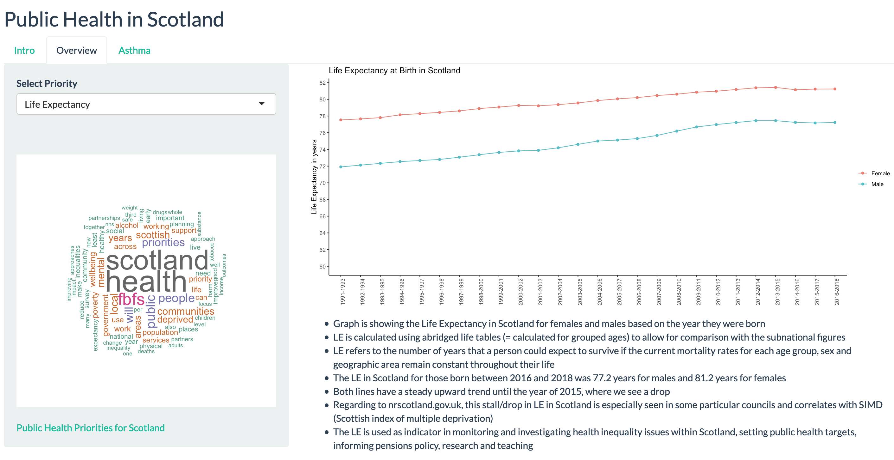
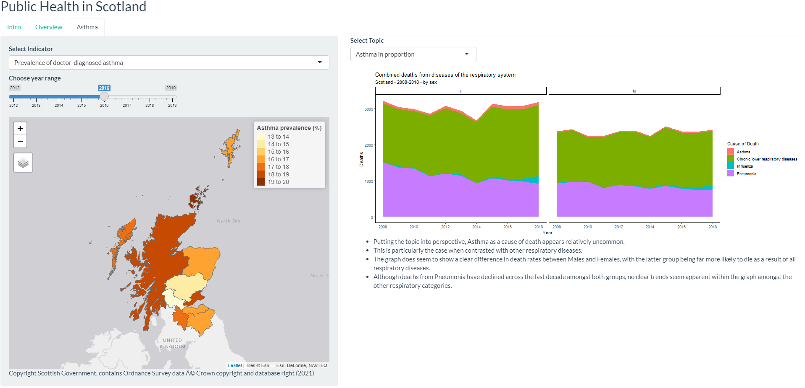

----------

## Interactive Dashboard Overview

### **Content**

The content presented within this dashboard derives from two main sources:

1. [Scotland's Public Health Priorities](https://www.gov.scot/binaries/content/documents/govscot/publications/corporate-report/2018/06/scotlands-public-health-priorities/documents/00536757-pdf/00536757-pdf/govscot%3Adocument/00536757.pdf) report produced in 2018 by the Scottish Government. The report outlines 6 Public Health Priorities (PHPs) that the government believe are most important to focus on over the next decade if we are to improve the health of the nation.
2. The second main source is the [statistics.gov.scot](https://statistics.gov.scot/home) website, which provided the majority of datasets used in the dashboard. Supplementary datasets from other sources have also been used.  

### **Structure**

The dashboard contains three tabs. One static (Intro) and two for the user to engage with (Overview and Asthma):

1. The **Intro** tab gives the dashboard user an introduction into the scope of the project.

2. The **Overview** tab presents visualisations of relevant measures which relate to each of the 6 Public Health Priorities (PHPs). Users may select a certain measure and then learn how this measure relates to one of the PHPs. Visualisations of each of the measures are presented in order to give the user a broad understanding of recent historical progress towards the goals established by each of the PHPs.

3. The second **Asthma** tab is a key tab in our dashboard. It provides tools for a more detailed analysis of Asthma in Scotland. This section of the dashboard allows the user to explore measures such as deaths and rates of hospitalization where asthma was the primary cause of such events. Data is presented from Temporal, Geographic and Demographic perspectives. A small statistical analysis is also included and presented.

----------
**Authors:**
Lauren D, James Hunter, Lenka Rozborilova, Doug Sloan
