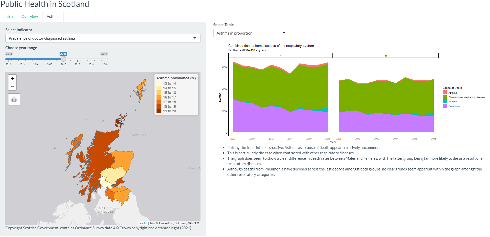

### Names of group members

Lauren D, James Hunter, Lenka Rozborilova, Doug Sloan

----------

### Roles & responsibilities of each member

**Lauren** worked on ...

**James** worked on ...

**Lenka** worked on ...

**Doug** worked on ...

----------

### Structure of the project

**Content**

The content presented within this dashboard derives from two main sources:

1. [Scotland's Public Health Priorities](https://www.gov.scot/binaries/content/documents/govscot/publications/corporate-report/2018/06/scotlands-public-health-priorities/documents/00536757-pdf/00536757-pdf/govscot%3Adocument/00536757.pdf) report produced in 2018 by the Scottish Government. The report outlines 6 Public Health Priorities (PHPs) that the government believe are most important to focus on over the next decade if we are to improve the health of the nation.
2. The second main source is the [statistics.gov.scot](https://statistics.gov.scot/home) website, which provided the majority of datasets used in the dashboard. Supplementary datasets from other sources have also been used.  

----------

**Structure**

The dashboard contains two key tabs for the user to engage with:

1. The **Overview** tab presents visualisations of relevant measures which relate to each of the 6 Public Health Priorities (PHPs). Users may select a certain measure and then learn how this measure relates to one of the PHPs. Visualisations of each of the measures are presented in order to give the user a broad understanding of recent historical progress towards the goals established by each of the PHPs.

2. The second **Asthma** tab is a key tab in our dashboard. It provides tools for a more detailed analysis of Asthma in Scotland. This section of the dashboard allows the user to explore measures such as deaths and rates of hospitalization where asthma was the primary cause of such events. Data is presented from Temporal, Geographic and Demographic perspectives. A small statistical analysis is also included and presented.

### Which tools were used in the project

* Zoom - used for working throughout the day together. 
* Trello - used to provide a broad schedule for the week's work and to assign specific homework tasks for individual members of the team.
* Google Docs - used to share immediate ideas on the project structure and content. Used for reference documentation including layered checklists (using the MoSCow technique) to be completed by the end of the project. Also used for daily meeting agendas and presentation preparation.
* Git/GitHub - collaboration & version control.
* Slack - used for sharing written content and links to useful sources of information/data for the project.

### How did you gather and synthesise requirements for the project?

We synthesised the information given in the brief by originally homing in on the particular public health themes prescribed as priorities by the Scottish Government. We then decided to structure the overview tab using measures related to these themes as a way of quantifying progress in public health over the last ten years. We then assigned different priorities to each member of the group, allowing them the freedom to explore data related to the measures and create visualisations that could be synthesised in the dashboard. We then set about exploring our specific theme (Asthma in Scotland) and developed a clear idea of the interactive elements that we wanted to have available to the user. Following this, we settled on a selection of interesting insights that we had come across and settled on the narrative that we wished to be conveyed in the Asthma tab.

We used the Q&A session with 'the client' to:

1. Confrim which groups in professionals or other groups in society did the client see as using the dashboard most on a day-to-day basis.
2. Ask what, ideally, the dashboard would be used for by these groups.
3. Ask how the client imagined the separation of general KPIs and more technical content contained in the dashbard. 
4. Confirmed the regional level to which the dashboard should ideally provide insights. This mainly involved the decision to include details of NHS Health Board areas, council areas, or both.
5. Confirmed the preferred format for the presentation. 

We prioritised individual exploration of the themes and relevant data during the early stages of the project. In practice, this meant everyone in the group was working on the same type of tasks, but with no duplication in content. Later, we prioritised working together to systhesize our content. This involved clear assignments of task and an understanding of what other members of the team were working on. Towards the end of the project, we prioritesed the overarching goals we had previous establised for the dashboard and made sure to systematically complete essential elements and mark these off appropriate checklists.

### Motivations for using the data you have chosen

We used a number of datasets from the [statistics.gov.scot](https://statistics.gov.scot/home) website and a further datasets from other sources (full list below). In terms of the overview tab, we were motivated to use as many datasets as necessary to allow us to provide insigths into each of the PHPs established by the Scottish Government. Our aim was to provide at least one measure that would show progress towards each of the priority goals. We also wanted to use as many data sets for this particular source in our overview tab as we knew that we would be more likely to use other sources for our theme tab. This was especially the case given the brief stated that the majority of our data sets should originate from the above source.

For the 

**Sources**

### Data quality and potential bias, including a brief summary of data cleaning and transformations

According to the About tab on the dataset page/dedicated page online, the data quality ...

The dataset may/may not be biased because ...

To clean the datasets we ...

### How is the data on statistics.gov.scot stored and structured

[**Hint**: This page offers a good starting point for understanding the data structure: https://guides.statistics.gov.scot/article/34-understanding-the-data-structure]

The data on statistics.gov.scot is in the form of ...

This means ...

Benefits of storing the data like this are ...

### Ethical and legal considerations of the data

[**Hint:** this page contains information on the Open Government License which covers most datasets on statistics.gov.scot: http://www.nationalarchives.gov.uk/doc/open-government-licence/version/3/]

There are no/There may be ethical considerations, because ...

The datasets are covered by the Open Government License, which means ...